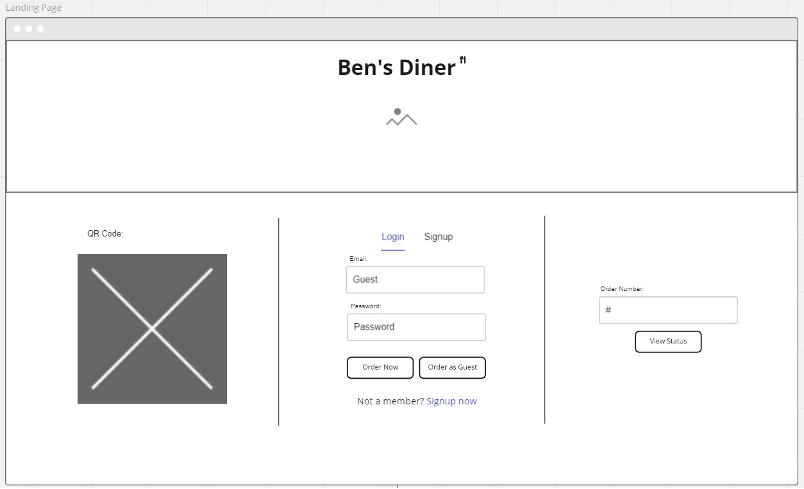
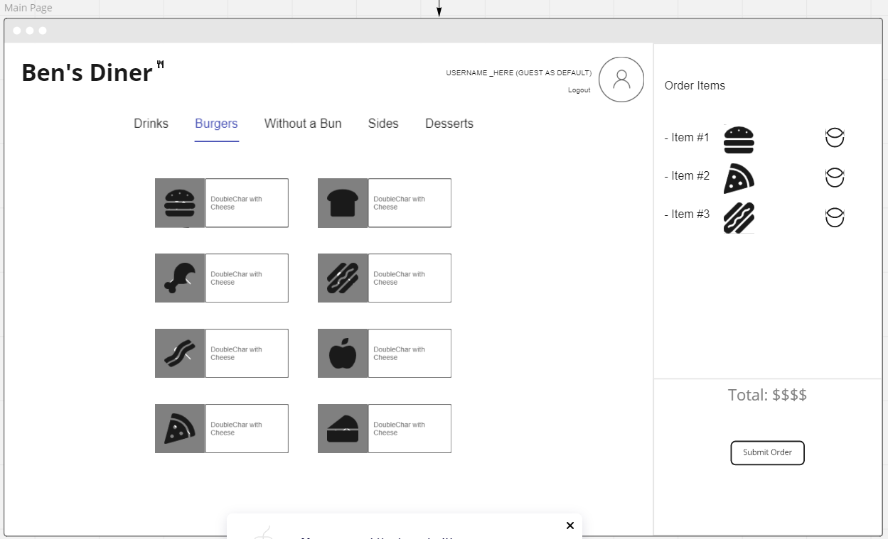
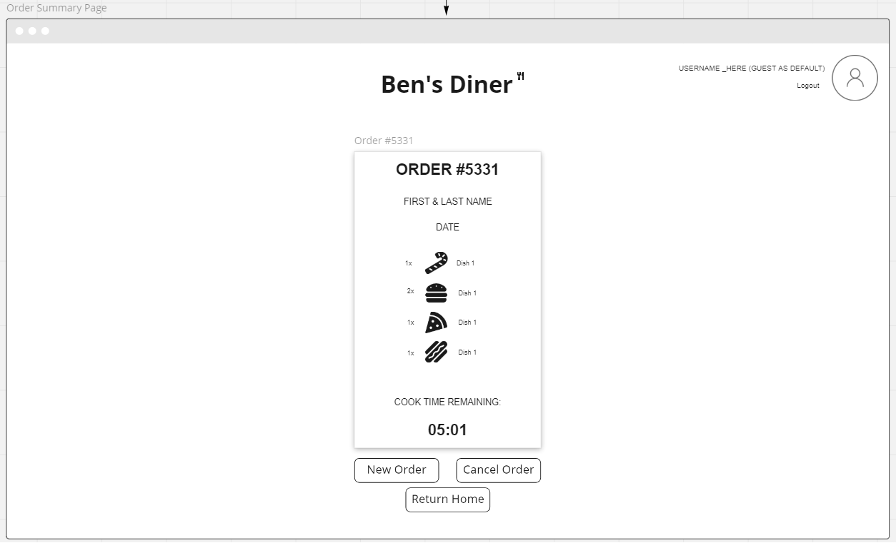

# Ben's Diner

## University of Washington, Full Stack Coding Bootcamp

### Group Project #2

### Natalie Bulger, Wonjong Park, Courtney Struelens, Vlad Berka

## Assignment Description

This is a Full Stack Web Development *group project* for the UW Bootcamp. The goal of the project is to create a fully functional full stack web application using all technnologies learned to date.
(Including `HTML`, `CSS`, `JavaScript`, `Bootstrap`, `Node.JS`, `Express.JS`, `Handlebars.JS`, `MySQL`, `Sequelize ORM`, `Model-View-Controller Paradigm`, `Bcrypt`, `Express-Session`, `.env`, `connect-session-sequelize`)

This project stresses equal importance between project management and web development.
A development process shall be identified and agreed upon to assist with pushing code, pulling code, and merging code conflicts on GitHub. This process shall include the division of labor and tasks.

A mockup / wireframe shall be created by an individual within the project team and used as a visual goal. (`UX/UI`)

A project user story and acceptance criteria shall be created by the project team and used as a functionality goal. (`Product Manager/Owner`)

Project management shall be `Agile` and augmented with `Kanban` style organization: with individual tasks divided, assigned, and tracked.

The group developed user story, acceptance criteria, and mockup for the assignment are copied to the end of this document.

## Project Scope

FOOD APP!
Create a full stack web page application that allows restaurant customers to view a digital menu, and order food without a human server interface.
Menu items shall be displayed and added to a shopping cart on click, with routes navigating various button events.
The temporary shopping cart will save data using `local storage`.
The permanent order history will available in a `MySQL database`.

Testing routes will be available using `Insomnia`.

No starting code has been provided.
No guidance, project choices, or project direction has been provided.

## Generalized Tasks

Web Development Tasks:
- Use the Bootstrap front-end framework and populate the DOM with: buttons, text areas, and cards in an organized layout
- Write handlebar.js files and "views" to handle custom information added to the website based on `MySQL` queries
- Write vascript functions to handle route requests to perform CRUD operations on a `MySQL` database (Create, Retrieve, Update, Delete)  
- Write javascript util functions for both front end and back end
- Use `Buttons` and `listenerEvents` to add web app functionality and responsiveness
- Use `@media queries` to add project screen adaptability and responsiveness
- Store translate history in `localStorage`

Project Management Tasks:
- Create a wireframe goal for the web app
- Identify and divide tasks among group members 
- Develop a process to cleanly push and pull code to GitHub to reduce merge conflicts 
- Check in with group members and *communicate* changes and problems

# Original Project Details

## User Story

```md
AS A business owner

I WANT customers to order through a web app
SO THAT I can receive orders
I WANT customers to create an account
SO THAT they can view past / active orders
I WANT customers to be able to order as guest
SO THAT they aren’t deterred by sign-in 
I WANT customers to be able to add and delete items from their order
SO THAT they can get exactly what they want
```

## Acceptance Criteria

```md
GIVEN a menu ordering page

WHEN I visit the site for the first time
THEN I am presented with a landing page with a QR code, log in form, and ability to check order status
WHEN I choose to sign up
THEN I am prompted to enter my name, email, phone number, and password
WHEN I click the sign up button
THEN MY user credentials are saved and I am logged into the site
WHEN I revisit later and choose to log in
THEN I am prompted to enter my email and password
WHEN I select Order as Guest or I am signed into the site
THEN I am presented with the main page with the restaurant title, tabs for food categories, food options based on default category, and a shopping cart to store orders
WHEN I select a food option 
THEN MY option is added to the cart with a delete option and the total price is updated
WHEN I select the trash can next to the food item
THEN the food item is deleted from the cart
WHEN I select the “submit order” button in the cart
THEN I am presented with a confirmation of my order with name and date, an order number, and estimated cook time remaining
```

## Miro Mockups








## URL to the GitHub Repository

[GitHub Pages Link:https://github.com/wonjong2/Bens_Diner](https://github.com/wonjong2/Bens_Diner)


## URL to the Heroku Hosted Application

[Ben's Diner, Heroku Deployment:https://bens-diner.herokuapp.com](https://bens-diner.herokuapp.com/)

## License

MIT License

Copyright (c) [2022] [Natalie Bulger, Wonjong Park, Courtney Struelens, Vlad Berka]

Permission is hereby granted, free of charge, to any person obtaining a copy
of this software and associated documentation files (the "Software"), to deal
in the Software without restriction, including without limitation the rights
to use, copy, modify, merge, publish, distribute, sublicense, and/or sell
copies of the Software, and to permit persons to whom the Software is
furnished to do so, subject to the following conditions:

The above copyright notice and this permission notice shall be included in all
copies or substantial portions of the Software.

THE SOFTWARE IS PROVIDED "AS IS", WITHOUT WARRANTY OF ANY KIND, EXPRESS OR
IMPLIED, INCLUDING BUT NOT LIMITED TO THE WARRANTIES OF MERCHANTABILITY,
FITNESS FOR A PARTICULAR PURPOSE AND NONINFRINGEMENT. IN NO EVENT SHALL THE
AUTHORS OR COPYRIGHT HOLDERS BE LIABLE FOR ANY CLAIM, DAMAGES OR OTHER
LIABILITY, WHETHER IN AN ACTION OF CONTRACT, TORT OR OTHERWISE, ARISING FROM,
OUT OF OR IN CONNECTION WITH THE SOFTWARE OR THE USE OR OTHER DEALINGS IN THE
SOFTWARE.
